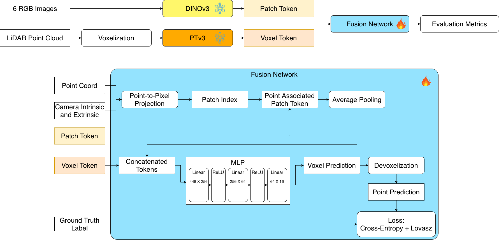

# 3D Semantic Segmentation Fusion of LiDAR and Camera (3DSSF)

This repository implements a **multi-modal 3D semantic segmentation and reconstruction system** that fuses **LiDAR point clouds and RGB images** for autonomous scene understanding.

Building on the Stanford 3D segmentation framework [1], this project integrates **DINOv3** [2] as the visual backbone in place of DINOv2 [3], evaluated on the **nuScenes** dataset [4]. 

By leveraging DINOv3’s enhanced visual embeddings and zero-shot capabilities, the system aims to achieve **more accurate, generalizable, and efficient 3D semantic mapping**.

## Key Highlights
- Fusion of **LiDAR (PTv3)** [5] and **image (DINOv3 or DINOv2)** features
- Evaluated on **nuScenes-Lidarseg** for real-world driving scenes  
- Includes **PointTransformerV3** integration and flexible feature fusion design



## Components
- **3D Backbone:** PointTransformerV3 (LiDAR feature encoder)  
- **2D Backbone:** DINOv3 ViT-S/16 or DINOv2 (visual feature extractor)  
- **Fusion Module:** projection-based cross-modal MLP fusion  
- **Training:** Cross-Entropy + Lovasz-Softmax loss for per-class IoU optimization

## 1. Download dataset
### 1.1 Make directory for dataset
```bash
mkdir <Path/To/dataset/nuscenes>
cd <Path/To/dataset/nuscenes>
```
### 1.2 Mini set (Optional)
```bash
wget https://www.nuscenes.org/data/v1.0-mini.tgz
tar -xvzf v1.0-mini.tgz
wget https://www.nuscenes.org/data/nuScenes-lidarseg-mini-v1.0.tar.bz2   
tar -xvjf nuScenes-lidarseg-mini-v1.0.tar.bz2
```
### 1.3 Training set
```bash
wget -c "https://motional-nuscenes.s3.amazonaws.com/public/v1.0/v1.0-trainval01_blobs.tgz"
tar -xvzf v1.0-trainval01_blobs.tgz
wget -c "https://motional-nuscenes.s3.amazonaws.com/public/v1.0/v1.0-trainval_meta.tgz"
tar -xvzf v1.0-trainval_meta.tgz
wget -c "https://d36yt3mvayqw5m.cloudfront.net/public/nuscenes-lidarseg-v1.0/nuScenes-lidarseg-all-v1.0.tar.bz2"
tar -xvjf nuScenes-lidarseg-all-v1.0.tar.bz2
```
### 1.4 Test set (Optional)
Use one of the train-val set as test set (label provided).
```bash
wget -c "ttps://motional-nuscenes.s3.amazonaws.com/public/v1.0/v1.0-trainval02_blobs.tgz"
```

## 2. Setup Guide

### 2.1 Clone the Repository and Initialize Submodules
```bash
git clone --recursive git@github.com:CharlesChang012/3D-Semantic-Segmentation-Fusion.git
```

### 2.2. Launch an Interactive GPU Session if using UMich HPC [6] (Skip to [Step 2.4](#24-create-the-conda-environment) if using local machine)
Start a GPU session (see [UMich documentation](https://documentation.its.umich.edu/node/5078)):  
```bash
salloc --account=<account> \   
       --partition=spgpu,gpu_mig40 \  
       --nodes=1 \
       --ntasks=1 \  
       --cpus-per-task=4 \      
       --gpus=1 \ 
       --mem=16G \   
       --time=01:00:00
```

**Helper commands:**
- Check available accounts:
  ```bash
  my_accounts
  ```
- Monitor active jobs:
  ```bash
  watch squeue --me
  ```

### 2.3 Load GPU and Compiler
```bash
module load cuda/12.1.1
module load gcc/11.2.0
nvcc --version
```

### 2.4 Create the Conda Environment
```bash
cd 3D-Semantic-Segmentation-Fusion
conda env create -f environment.yml
conda activate 3DSSF
```

### 2.5 Build PointOps from PointTransformerV3 Source
```bash
cd PointTransformerV3/Pointcept/libs/pointops/
python setup.py install
```

## 3. Train the model
```bash
python main_train.py
```

## 4. Test model on test set
```bash
python main_test.py
```

## 5. Test model on a single test sample
```bash
python main_sample.py
```
---

## 📚 References
[1] Anze Liu, 3D Semantic Segmentation with 3D LiDAR Point Clouds and 2D Camera Images for Autonomous Driving, Standford  
[2] Oquab et al., *DINOv3: Self-Supervised Vision Transformers with Masked Image Modeling*, Meta AI, 2025  
[3] Oquab et al., *DINOv2: Learning Robust Visual Features without Supervision*, Meta AI, 2023  
[4] Caesar et al., *nuScenes: A Multimodal Dataset for Autonomous Driving*, CVPR 2020  
[5] Wu et al., *Point Transformer V3: Simplicity, Efficiency, and Performance in Point Cloud Transformers*, arXiv 2024  
[6] [UMich ARC Documentation](https://documentation.its.umich.edu/node/5078)
